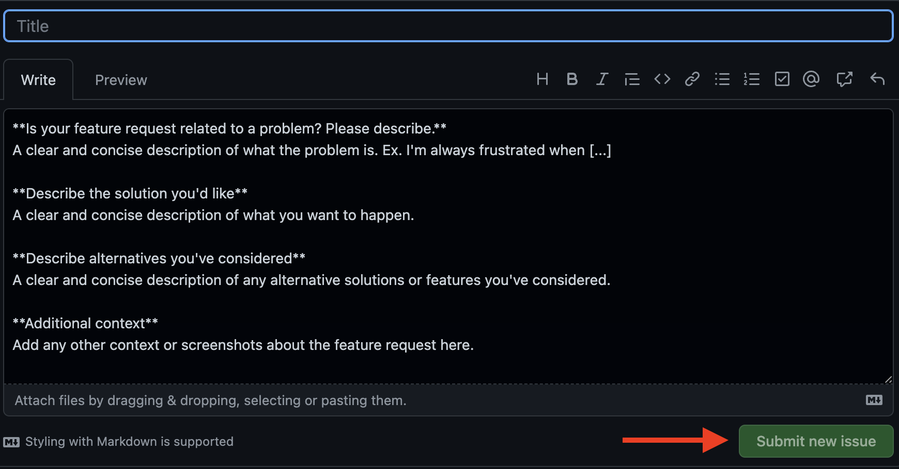

# OpenV2X 代码贡献指南

OpenV2X 团队很乐意接受任何愿意合作的组织和个人的代码贡献。根据参与者的能力的区别，可以有不同的方式为项目做出贡献。本团队将尽可能及时处理相关工作，以便将所有贡献成功集成到 OpenV2X 中。

请阅读本指南，不要犹豫！

- [OpenV2X 代码贡献指南](#openv2x-代码贡献指南)
  - [报告错误](#报告错误)
  - [提出需求](#提出需求)
  - [贡献代码](#贡献代码)
    - [开始之前](#开始之前)
    - [代码规范](#代码规范)
    - [提交代码](#提交代码)
    - [检查清单](#检查清单)
  - [文档贡献](#文档贡献)

## 报告错误

如果您在 OpenV2X 中发现了 bug，请在 GitHub 上提交一个 `issue`。 针对不同的仓库，它们的 `issues` 链接分别为
[centerview](https://github.com/open-v2x/centerview/issues),
[cerebrum](https://github.com/open-v2x/cerebrum/issues),
[dandelion](https://github.com/open-v2x/dandelion/issues),
[edgeview](https://github.com/open-v2x/edgeview/issues) 和
[roadmocker](https://github.com/open-v2x/roadmocker/issues)。 在报告新错误之前，请确保做如下一些检查。

**1. 检查这个 bug 是否已经被提交过。** 在 GitHub 上的对应仓库的 `issues` 部分中查找它。

**2. 阅读文档。** 确保提出的问题是一个 bug，而不是对 OpenV2X 本身如何运行的误解。

**3. 遵循模板要求提交 bug。** 请按照模板要求 填写必要的信息。 
 

## 提出需求

关于新功能的想法也是参与贡献的好方法。任何可以改善用户体验的建议都可以在相应的 GitHub 部分提交。这些部分与上面提到的 `issues` 部分完全相同。 请点击 **feature
request** 按钮并按照模板要求填写必要的信息  

## 贡献代码

在开始动手写代码之前, 请查看 **issue board** 以确认团队目前正在进行的工作, 从而避免重复。 如有疑问请联系我们 (或者发送邮件至 contact@openv2x。org)。

为了顺利地开展您的工作, 首先需要 `fork` **对应的 OpenV2X 仓库**, 并将此 `fork` `clone` 至本地。 记得让您的 `fork`
跟原仓库[保持同步]((https://docs.github.com/en/enterprise/2.13/user/articles/syncing-a-fork))。

### 开始之前

查看[OpenV2X 架构设计文档](v2x-1.0.126-architectural-design.md)，了解组成 OpenV2X
的不同模块。选择最合适的一个来加入新功能。如果在此过程中出现任何问题，请随时与我们的团队联系。

### 代码规范

提交新代码时，请遵循当前的编码标准。

### 提交代码

贡献的代码和新的功能并不会直接合并进 `master` 分支, 而是合并进一个名为 `dev` 的临时分支。 这样的 Git 流程可以让我们更容易维护一个稳定的 `master` 分支。

始终保持您的 `dev` 分支更新到最新修改的版本。在名为 `username/name_of_the_contribution` 的子分支中进行开发。 一旦贡献准备就绪，从您的子分支向 `dev`
分支提交 `pull-request`。请将您的
[`pull-request` 关联到对应的 `issue`](https://docs.github.com/cn/issues/tracking-your-work-with-issues/linking-a-pull-request-to-an-issue)，您可以使用关键词将
`pull-request` 链接到 `issue`，也可以用手动的方式将 `pull-request` 链接到 `issue`。请尽量使用具有描述性的语句来填写 `description`。关于
`pull-request` 的更多详细信息，请参考
[`pull-request` 规范](./v2x_pull_request_standard-zh_CN.md)。请注意，在新代码通过合并之前会有一些检查要求。检查由持续集成系统自动运行。如果检查成功，将出现绿色标记。如果出现红色标记，请相应地更正代码。一旦在
`dev` 分支合并代码后，可以使用其他新功能对其进行测试。等到下一个版本发布时，`dev` 分支将会被合并到 `master` 分支，并将宣布贡献。

### 检查清单

- 您的分支是最新的 `dev` 分支，并使用最新更改进行了测试。
- 如有必要，可以添加 README/documentation 内容。
- 代码编译正确。
- 所有测试通过，使用 `tox` 或 `npm test`。

## 文档贡献

如果某些文档缺失，模糊或不精确，则可以像报告任何其他错误一样 (请阅读之前的部分
[如何提交错误](#报告错误))。此外，用户也可以通过编写文档来做出贡献。要提交文档贡献，请按照上面说明的相同[贡献代码](#贡献代码)工作流程操作。总而言之，贡献是在 `dev`
的子分支中进行的，最终将被合并到 `dev` 分支中。
